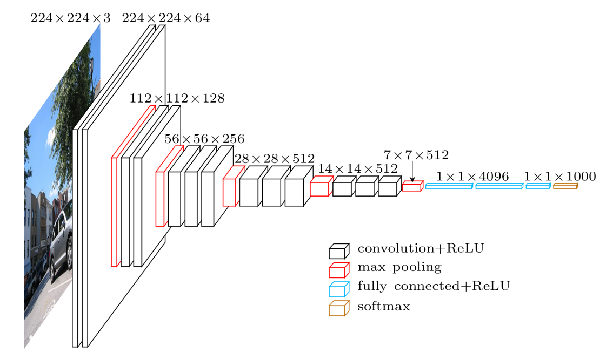
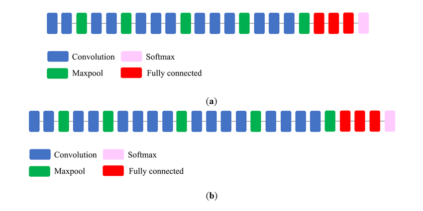
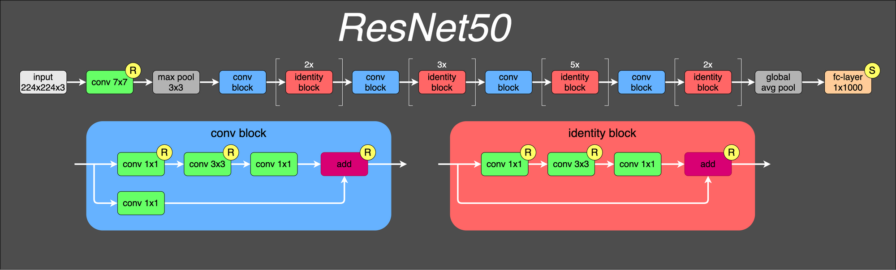
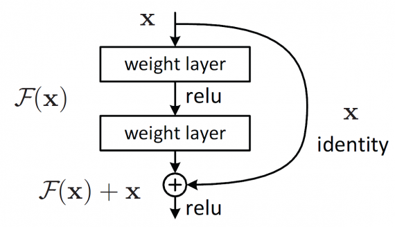

# Лабораторная работа №3

## Цель работы
Научиться создавать простые системы классификации изображений на основе сверточных нейронных сетей.

## Задание
  1. Реализовать систему классификации согласно описанию, используя не менее трех различных архитектур нейронной сети.
  2. Сравнить качество работы, скорость и количество потребляемой памяти для каждой архитектуры.
  3. Сделать отчёт в виде readme на GitHub, там же должен быть выложен исходный код

## Описание
Необходимо реализовать простейшую систему классификации изображений на основе сверточных нейронных сетей. Возможно использовать любые доступные технологии, рекомендованный список такой:
  - Google Colab для запуска (можно другую платформу или локальную машину)
  - PyTorch
  - Torchvision

Система должна загружать изображение с диска, преобразовывать в нужный для обработки моделью нейронной сети формат (тензор), выполнять предобработку, если требуется (например, изменение размера и нормирование), затем обрабатывать с помощью нейронной сети и выводить результат (номер класса, название, его вероятность для первых 5 наиболее вероятных классов). Необходимо провести исследование по сравнению эффективности трех разных архитектур (можно использовать предобученные модели из torchvision.models https://pytorch.org/vision/stable/models.html, например, AlexNet, VGG16, ResNet50). Нужно узнать, на каком датасете предобучены данные модели (использовать веса, полученные с одного и того же набора) и найти список классов, которые они предсказывают. 

Каждую модель необходимо протестировать на вашем собственном наборе из не менее чем 50 изображений (можно использовать любые изображения, но не те, которые использовались для обучения), в качестве метрик использовать top-1 accuracy и top-5 accuracy. В данной работе не требуется проводить обучение нейронной сети (только по желанию).

## Теория
Классификация изображений – это процесс извлечения классов информации из многоканального растрового изображения. Растр, полученный в результате классификации изображения, можно использовать для создания тематических карт. В зависимости от характера взаимодействия аналитика с компьютером в процессе классификации, различают два типа классификации изображений: классификацию с обучением и классификацию без обучения.

### Архитектуры используемых моделей

#### AlexNet

Convolutional (CONV) - 5 уровней

Fully Connected (FC) - 3 уровня

Используемая активация - ReLU

~62 миллиона обучаемых переменных 

*Схема сети AlexNet*

#### VGG

VGGNet существует несколько видов, отличающиеся общим количеством слоев в сети. В архитектуре VGG16 в сумме 16 сверточных и полносвязных слоев, в VGG19 – соответственно 19 слоев. Повышение качества предсказания улучшалось за счёт углубления сети и добавления слоёв пакетной нормализации. Но также бездумное увеличение количества слоёв значительно повышает объём модели. И не стоит забывать, что по мере углубления будет сильнее заметна проблема затухания градиентов, из-за чего модель будет обучаться значительно дольше, чем нам этого хотелось бы. 
Как минус можно отметить её большой размер (около 138.4 миллионов параметров).

*Схема сети VGG16*

*Сравнение VGG16 и VGG19*

#### ResNet

ResNet использует блоки с остаточной связью. Данные как бы "пропускают" несколько слоёв нейронной сети и конкатенировались с данными, прошедшими преобразования. Такие пропуски позволяли эффективно распространяться по сети градиентам.
Resnet18 имеет ~11 миллионов обучаемых параметров.

*Схема сети ResNet*

*Схема блока с остаточной связью*

### Сравнение по accuracy, времени выполнения и памяти:

### Выводы:
В результате работы была исследована система классификации изображений с использованием трех сверточных нейронных сетей: AlexNet, VGG19 и ResNet50. Оценочными характеристиками выступили: accuracy, время выполнения и объем используемой памяти GPU.

## Ссылки на источники: 

https://habr.com/ru/company/nix/blog/430524/

https://pytorch.org/vision/stable/models.html

https://towardsdatascience.com/alexnet-the-architecture-that-challenged-cnns-e406d5297951

https://neurohive.io/ru/vidy-nejrosetej/vgg16-model/

https://www.tensorflow.org/api_docs/python/tf/keras/applications

https://deeplearning.cms.waikato.ac.nz/user-guide/class-maps/IMAGENET/
